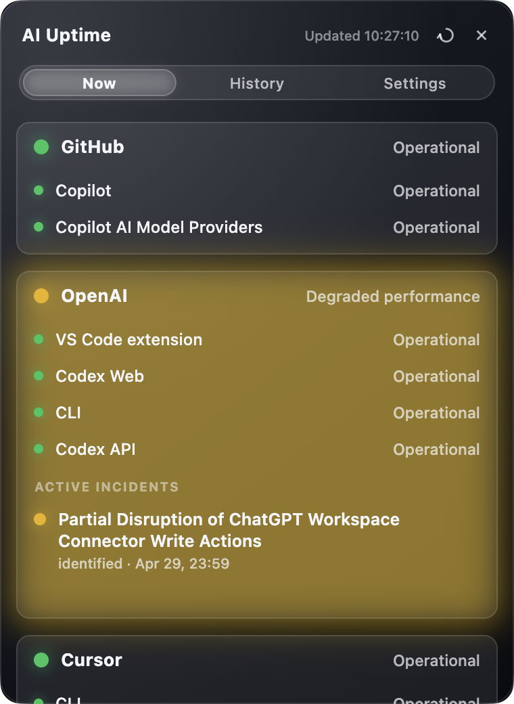
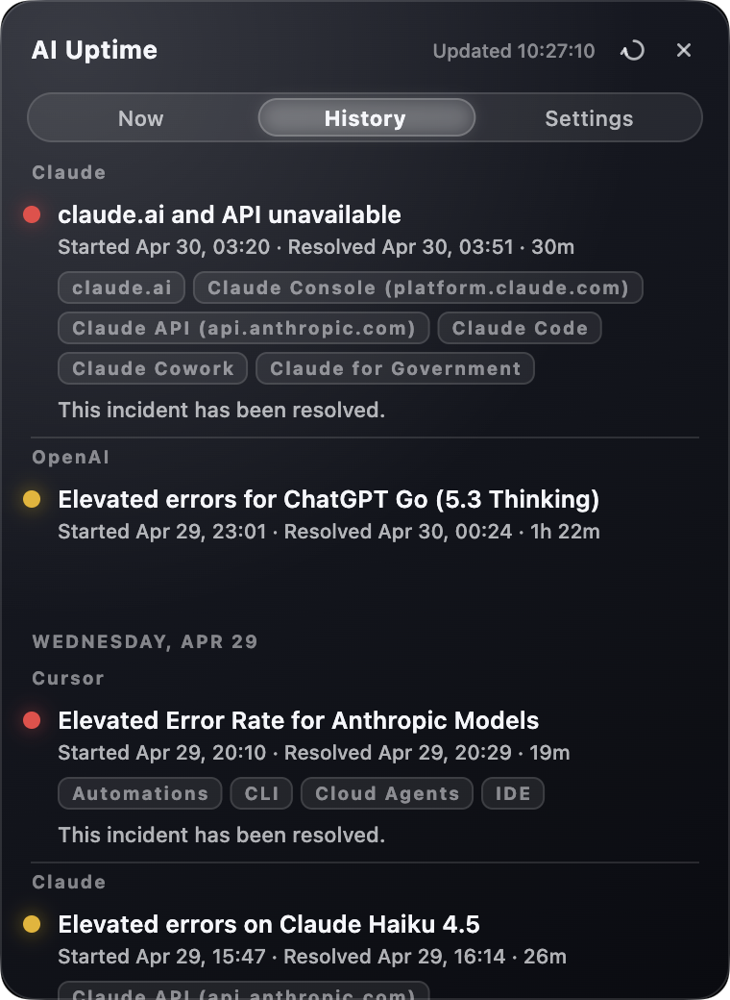
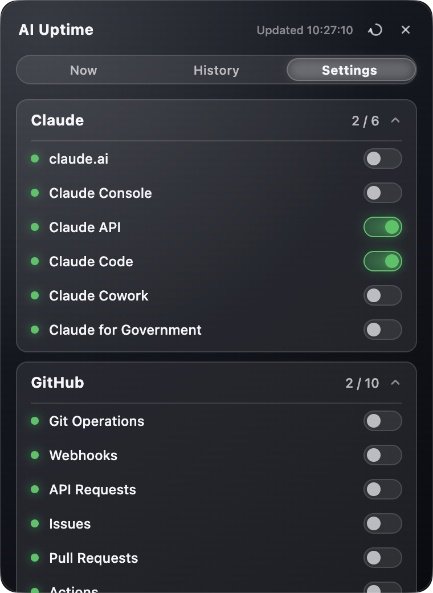

# AI Uptime

**AI Uptime** is a desktop tray app that monitors public status pages for Claude, GitHub, OpenAI, and Cursor.

<p align="center">
  
  
  
</p>

## Features

- Tray-first desktop experience for macOS and Linux
- Current status view for Claude, GitHub, OpenAI, and Cursor
- GitHub region switching for EU, US, Australia, and Japan
- 7-day incident history
- Per-component visibility controls
- Configurable polling interval
- Optional notifications for new incidents, component changes, and resolved incidents
- Persisted theme and text size settings

## Quick start

Install dependencies:

```bash
flutter pub get
```

Run on macOS:

```bash
flutter run -d macos
```

Run on Linux:

```bash
flutter run -d linux
```

## Development

Run analysis:

```bash
flutter analyze
```

Run tests:

```bash
flutter test
```

## Contributing

See [CONTRIBUTING.md](./CONTRIBUTING.md) for development workflow, pull request expectations, and testing guidance.

## License

Licensed under [Apache-2.0](./LICENSE).
